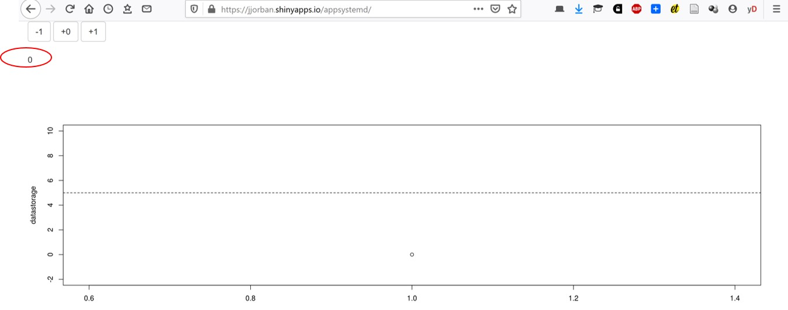
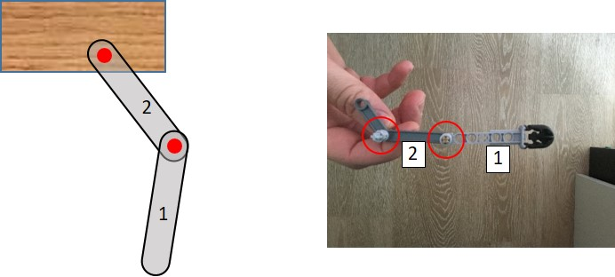
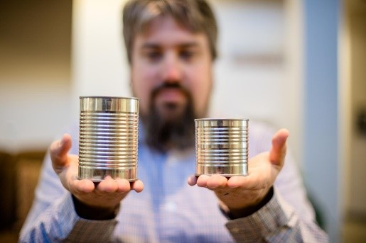

#### Q1: Why can a robot balance a short stick and we are unable to do so ? What are the consequences of that feature?

**Learning goal:** sensorimotor delays in the motor system.

**Main reference:** paragraph on “delays” in Computational Mechanisms of Sensorimotor Control - Franklin and Wolpert: [https://www.ncbi.nlm.nih.gov/pubmed/22078503](https://www.ncbi.nlm.nih.gov/pubmed/22078503)

Additional reference: [https://www.ncbi.nlm.nih.gov/pubmed/18479557](https://www.ncbi.nlm.nih.gov/pubmed/18479557)

**Theoretical question:** How can we demonstrate the presence of delays in the brain? What is the nature of these delays? What is the impact of delays on the control of our movements?

**Experiment: **

*   Take a long stick and choose a participant. You will hold the stick vertically in the air between the subject's thumb and index finger without touching them. The top of the stick needs to be located between the thumb and finger. Without warning, let the stick drop - the subject must catch it as quickly as possible. Measure in meters the distance the stick fell by measuring the distance between the top of the stick and the location of the participant’s finger. Take the average of 3 consecutive drops. Transform this average distance into a reaction time with the following formula:
Reaction time = √((2*d)/9.81) where d is the average distance.

*   Balance a short (~30cm) and a long (>1m) stick on your finger. Which one is easier? Why ? Compare then your performance to that of a robot: [https://www.youtube.com/watch?v=vf5tdG74WhQ](https://www.youtube.com/watch?v=vf5tdG74WhQ)

*   On both websites below, you control the value of the displayed number (which starts at zero) by pressing the “-1”, “+0” , “+1” buttons. Each time you press a button, it has an effect on the value of that number. Your goal is to bring this number to five and to maintain it at that value for five consecutive button presses (in other words, you have reached the goal when you maintain that number to five while pressing the “+0” button five times).
	-   Easy condition:  https://jjorban.shinyapps.io/appsystemd/
	-   Difficult condition: https://jjorban.shinyapps.io/appdelay3/

 
Figure 1 : Illustration of the task : the number you control is circled in red. The buttons to control this number are circled in green. The graphics give you the the evolution of the circled number over the number of button presses. It is updated each time you press one of the button. 

#### Q2: What type of sensory information are we using to control our movement? 

**Learning goal:** type and role of sensory information for the control of movements

**Main reference:** https://www.ncbi.nlm.nih.gov/pmc/articles/PMC3709263/

Additional reference about proprioception: https://doi.org/10.1016/B978-008045046-9.01907-0

**Experiment:** 

1.    Put your two arms stretched away from your body (left arm to the left and right arm to the right). Then close your eyes and try to make your two index fingers touch while keeping your eyes closed. Observe someone performing the above experiment.

2.    Watch the following video [https://www.youtube.com/watch?v=0LfJ3M3Kn80](https://www.youtube.com/watch?v=0LfJ3M3Kn80) Do you think that it would be able to do the exercise described in 1.

3.    Ask someone to grab a match from within a matchbox full of matches with their index and thumb fingers in the three following conditions (and in that order):
      a.  With naked hand and fingers in the absence of vision (i.e. with eyes closed)
      b.  With both fingers covered by a plaster in the absence of vision (i.e. with eyes closed). Alternatively, you could ask your participant to wear a thin glove such as a rubber glove
      c.  Same as in b but with eyes open.

#### Q3: Can we use information about our own movements?

**Learning goal:** internal model and state estimation

**Main reference:** “state estimation” in Computational Mechanisms of Sensorimotor Control - Franklin and Wolpert

Additional reference: https://doi.org/10.1007/978-94-007-1333-8_57

**Experiment: **

*	Ask a participant to stand with his dominant arm fully stretched horizontally in front of him with the palm of the hand upward (see picture). Place a heavy object (~ 2kg, e.g. a dictionary, the pink ball on the picture) on his palm and tell the participant that his/her goal is to maintain his/her arm as horizontal as he/she can. After 3s, pick up the object from the hand of the participant and observe the movement of the arm. Then, put the object back on the palm of the participant and ask him/her to pick the object him/herself from their own hand. Observe the movement of the arm.

*   Build the following setup of two sticks with one articulation (like upper and lower arm). Join the two ends of the two sticks together with a nail (red dot) such that they can freely rotate around each other. Fix one end of one the two sticks (gray bars) with a nail on a wooden board (represented by the red dot). Alternatively, one can build this using Lego bricks (right panel). Experiment: make the free stick (#1) rotate fast around the articulation (red dot) by punching it fast in one direction or the other. Observe whether stick #2 stays in place or not?

 

Now, do it with your own lower arm: execute a pure rotation of your lower arm around the elbow. Does your upper arm move?

#### Q4: how does the brain merge different sources of information?

**Learning goal:** reliability-based integration of different signals

**Main reference:** https://doi.org/10.1016/j.tics.2006.05.003

**Experiment:**

*   McGurk effect. Watch the following video and see whether what you hear can be influenced by what you see [https://www.youtube.com/watch?v=2k8fHR9jKVM](https://www.youtube.com/watch?v=2k8fHR9jKVM)

*   Make two containers that look identical from the outside (e.g. the same material) but have two different sizes (see picture). Fill them with something such that actually have the exact same weight. Put them on a table in front of a participant. Ask the participant to lift them one after the other and to then report whether the two containers have the same weight or not. What are the two sources of information that the participant is using to come to that conclusion.

 

#### Q5: Why are movements stereotyped but variable?

**Learning goal:** What are the sources of noise in the brain ? How does the brain cope with uncertainty/variability ? What types of costs are taken into account when planning a movement ? 

**Main Reference:** Introduction + “Optimal (feedback) control theory”
The coordination of movement: optimal feedback control and beyond. J Diedrichsen, R Shadmehr, and RB Ivry (2010) Trends in Cognitive Sciences 14:31-39.

Additional references:

*   “Balancing Expected Rewards with Motor Costs” and “The Problem of How to Do It: Minimizing Costs to Find a Control Policy” in Computational approaches to motor control. Reza Shadmehr (2009) In: LR Squire (ed.) Encyclopedia of Neuroscience 3:9-17.

*   Noise in the nervous system: https://www.ncbi.nlm.nih.gov/pubmed/18319728	

**Experiment:** 

Draw two squares of 0.5cm (side) on a piece of paper 15cm apart, one green, one white (with a black outline). Ask a participant to make 20 reaching movement with a pen from the green to the white target. The participant does not need to stop on the target but needs to shoot through the target. He can stop further on the piece of paper. Ask the participant to have a single continuous movement and to not correct its movement while moving. In other words, the movement needs to be as straight as possible.

 

There are multiple conditions:

1.    Reach 10 times at a comfortable speed (always from green to white)

2.    On another paper, reach 10 times as fast as you can (always from green to white). The goals is nonetheless to pass through the white target. The participants should never stop during the movement even if s/he misses the target.

3.    On a third paper, draw a wider white target (8cm wide, see panel B of the figure). Ask the participants to reach as fast as possible.

Draw then a horizontal line that passes through the middle of the white targets (perpendicular to the movement direction). With a red pen, mark the intersection between the movement traces (left by the pen during movements) and this horizontal line. These red points represent the endpoint of the reaching movements. We are interested in the variability of these red points across the three conditions. Reflect on whether every movement has the same or different endpoint. What is the effect of speed on endpoint variability? What is the effect of target width on endpoint variability?
